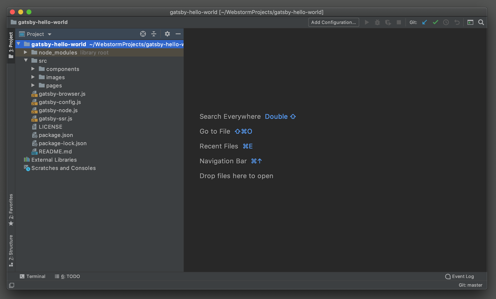
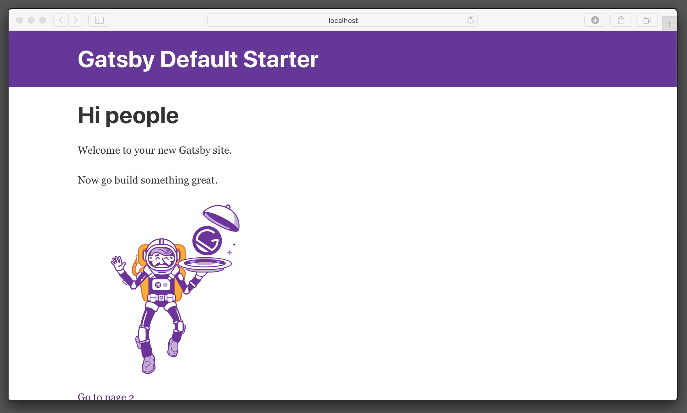
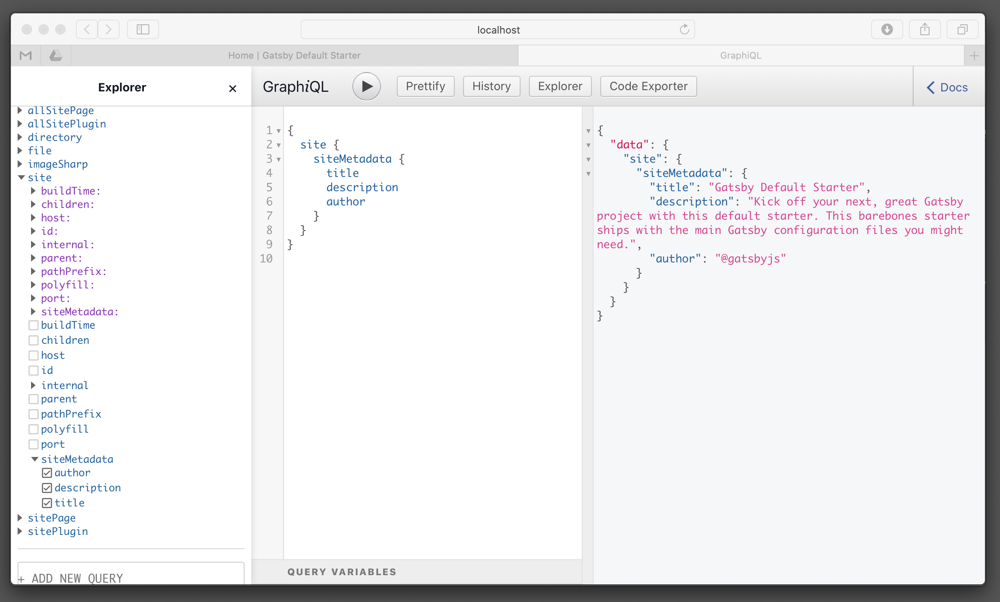
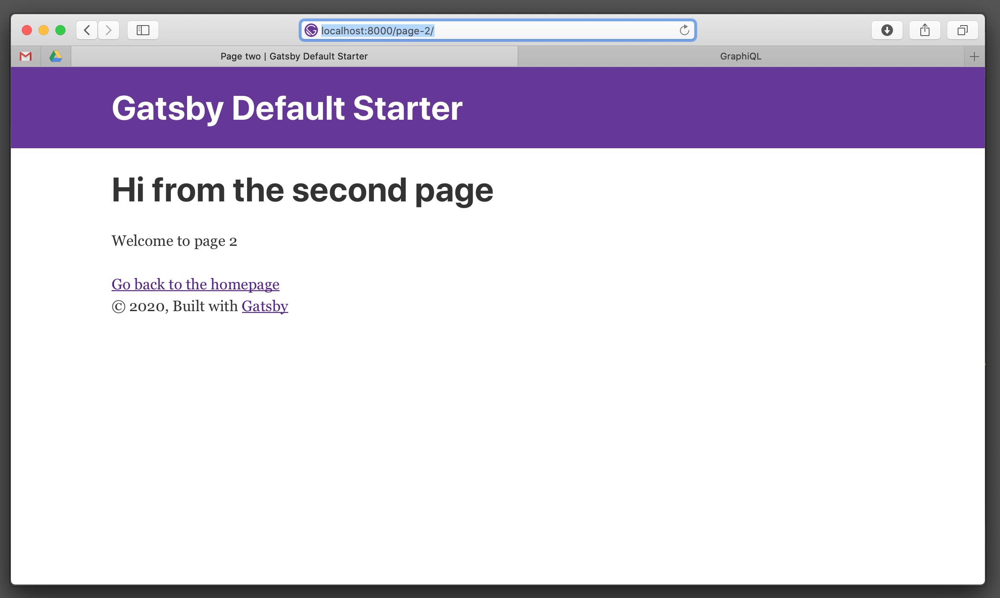
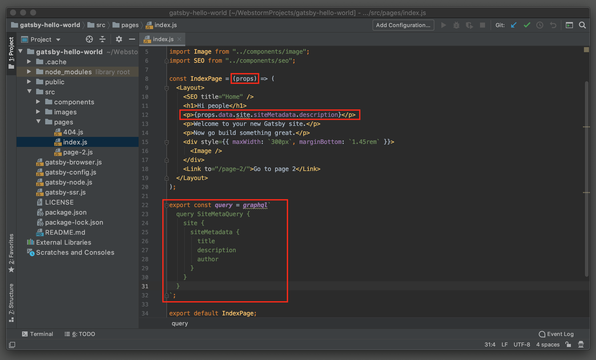
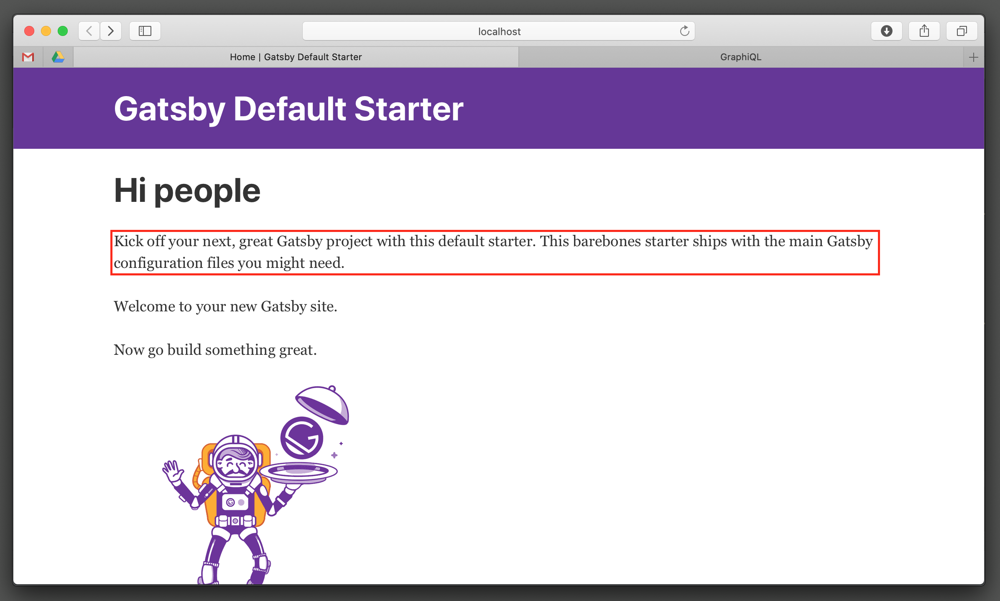

上一篇 [初识 Gatsby 和 JAMStack](https://www.notion.so/Gatsby-JAMStack-fe78932c530e42d6a2d261f8f77bfab3) 这一篇主要将一下如何开始一个 Gatsby 的项目和一些基础概念。

# 搭建环境

首先要确定 Node.js, Git 已经安装好。然后安装 gatsby-cli

    $ npm install -g gatsby-cli

# 创建一个Gatsby网站

Gatsby 给我们提供了大量网站模版和主题([https://www.gatsbyjs.org/starters/?v=2](https://www.gatsbyjs.org/starters/?v=2))。我们以 gatsby-starter-default 初始化一个默认的的 Gatsby 项目

    $ gatsby new gatsby-hello-world https://github.com/gatsbyjs/gatsby-starter-default

完成之后，进入工程目录，这样的结构

执行

    $ gatsby develop
    ...
    You can now view gatsby-starter-default in the browser.
    ⠀
      http://localhost:8000/
    ⠀
    View GraphiQL, an in-browser IDE, to explore your site's data and schema
    ⠀
      http://localhost:8000/___graphql
    ⠀
    Note that the development build is not optimized.
    To create a production build, use gatsby build
    ⠀
    success Building development bundle - 5.493s

Gatsby 会显示两个 URL，第一个是网站入口，打开浏览器访问可以看到下面的页面，

第二个是 Gatsby 集成的 GraphQL Explorer，在这个面板上可以查询 Gatsby 的 GraphQL 中可以访问的全部资源和数据。

## Gatsby Config

回到 Gatsby 的工程目录中，gatsby-config.js 是 Gatsby 项目的配置文件，这个文件中导出了一个包含 siteMetadata 和 plugins 两个 key 的 JSON 对象。

### siteMetadata

是网站的元信息，通常我我们可以配置一些网站的 title、description、author之类的信息，当然也可以自己随意加入更多的元信息，配置后可以从 GraphQL 中查询 site.siteMetadata 获取到这里配置的数据。

    module.exports = {
      siteMetadata: {
        title: `Gatsby Default Starter`,
        description: `Kick off your next, great Gatsby project with this default starter. This barebones starter ships with the main Gatsby configuration files you might need.`,
        author: `@gatsbyjs`,
      }
    }

## plugins

包含了工程中所有需要用到的 Gatsby 的插件的列表，Gatsby 的插件都是实现了 Gatsby 的某些 API的 npm 的包，均可以使用 `npm install gatsby-plugin-name` 来安装，如果插件不需要配置可以只写一个插件名，如果需要配置，那么就要使用一个包含插件名和配置的 object。Gatsby 默认项目中的配置如下。

    module.exports = {
      ...
      plugins: [
        `gatsby-plugin-react-helmet`,
        {
          resolve: `gatsby-source-filesystem`,
          options: {
            name: `images`,
            path: `${__dirname}/src/images`,
          },
        },
        `gatsby-transformer-sharp`,
        `gatsby-plugin-sharp`,
        {
          resolve: `gatsby-plugin-manifest`,
          options: {
            name: `gatsby-starter-default`,
            short_name: `starter`,
            start_url: `/`,
            background_color: `#663399`,
            theme_color: `#663399`,
            display: `minimal-ui`,
            icon: `src/images/gatsby-icon.png`, // This path is relative to the root of the site.
          },
        },
      ],
    }

具体的插件可以到下面的链接中查找。

[Plugins | GatsbyJS](https://www.gatsbyjs.org/plugins/)

其他还有 pathPrefix, polyfill, mapping, proxy, developMiddleware 不过这些都不重要，暂时用不到。

详细的官方文档请查看

[Gatsby Config API](https://www.gatsbyjs.org/docs/gatsby-config/)

## Pages

打开源码 (src) 文件夹中的 pages 文件夹，可以看到老熟人 index.js。这是一个 JSX 编写的 React Components，也就是我们刚刚在浏览器中打开的网站主页。（还不知道什么是 JSX？先去了解一下 React.js）

Gatsby 默认会把 src/pages 中的全部 JSX 根据目录结构构建成网站页面，也就是说，你可以直接在浏览器中通过 http://[localhost:8000/page-2](http://localhost:8000/page-2) 来访问 src/pages/page-2.js 中编写的页面组件。也就是说如果新建一个 src/pages/subfolder/another-page.js 并在文件中 export 一个 React Component，那么也可以通过 http://[localhost:8000/](http://localhost:8000/page-2)subfolder/another-page 来访问这个页面。

回到我们的 index.js，如何页面中融入 GraphQL 来使用我们刚刚配置的 siteMetadata 呢？

只需要把我们刚刚在 GraphQL Explorer 执行成功的查询，贴到文件下方的 graphql 中，并 export。 Gatsby 对 graphql 施了魔法，会把查询结果保存到 React Component 的 props.data 中。所以我们只需要在组件参数中加入 props，就可以使用查询结果了。如下图所示，

现在我们回来看我们的网站主页

siteMetadata 中的 description 已经加入到网页中了。

## Link API

对于网站的内部导航，Gatsby 提供了一个 Link 组件链接内部页面，和一个 navigate 函数实现在代码中的跳转。Link 组件在实现跳转之外，Gatsby 对其做了预加载的功能来提升网站访问速度。Gatsby 会根据用户行为，按优先级预加载网页中的 Link 所指向的页面。

最基本的使用就是 `<Link to="/blog">blog</Link>` 。

具体的用法和高级用法可以参见

[Gatsby Link API](https://www.gatsbyjs.org/docs/gatsby-link/)

英文不好的同学可以猛击

[Gatsby Link API](https://www.gatsbyjs.cn/docs/gatsby-link/)

## Components

在 components 文件夹中我们同样也可以看到很多 JSX，同是 JSX，comonents 与 pages 存在两个不同

1. Gatsby 不会默认将这个文件夹中的 React Component 构建成网站页面，当然你可以在 gatsby-node.js 中使用 createPages API 将 任意位置的 React Component 构建页面（在后面会说到）。
2. 作为非页面组件，是无法使用 graphql 魔法的，但是在 Gatsby v2 中提供了 StaticQuery 组件和 useStaticQuery Hook，与页面的 graphql 不同的是 StaticQuery 无法接受传参，而 graphql 可以通过 pageContext 传参，以实现统一模版的不同页面得到不同的数据。
